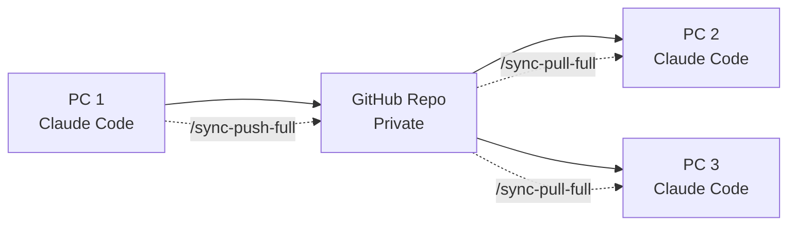

# 🔄 Claude Context Sync

**Seamlessly sync your Claude Code context and data across multiple PCs using GitHub**

[](https://opensource.org/licenses/MIT)
[](https://github.com/shaike1/claude-sync/stargazers)

## 🎯 What This Solves

Using Claude Code on multiple PCs? Tired of manually copying `CLAUDE.md` files between machines? This tool automatically syncs your entire Claude Code experience across all your devices.

## 🚀 Features

### 🔧 Essential Sync
- **`CLAUDE.md`** - Your project contexts
- **Claude Settings** - Preferences and configurations  
- **Conversation Sessions** - Complete chat history (up to 1MB+)
- **MCP Configurations** - Server setups and integrations
- **Todo Lists** - Task tracking data

### 🌟 Full Sync (Everything)
- All essential items **PLUS**:
- **Shell Integration** - Custom shell snapshots
- **Slash Commands** - Your custom Claude commands
- **Complete User Profile** - Every setting preserved

## 📥 One-Line Installation

### Basic Context Sync
```bash
curl -sSL https://raw.githubusercontent.com/shaike1/claude-sync/main/install.sh | bash -s -- https://github.com/YOUR_USERNAME/YOUR_REPO
```

### Full Data Sync (Recommended)
```bash
curl -sSL https://raw.githubusercontent.com/shaike1/claude-sync/main/install-full.sh | bash -s -- https://github.com/YOUR_USERNAME/YOUR_REPO full
```

## 🛠️ Quick Setup

### 1. Create GitHub Repository
1. Go to [GitHub](https://github.com/new)
2. Create a **private** repository named `claude-sync`
3. Don't initialize with README

### 2. Install on First PC
```bash
# Replace with your GitHub username
curl -sSL https://raw.githubusercontent.com/shaike1/claude-sync/main/install-full.sh | bash -s -- https://github.com/YOUR_USERNAME/claude-sync full
```

### 3. Install on Other PCs
Run the same command on all other machines - they'll sync automatically!

### 4. Start Using
- Use `/sync-push-full` to upload your data
- Use `/sync-pull-full` to download from other PCs  
- Use `/sync-full` for bidirectional sync

## 📝 Available Slash Commands

After installation, these commands are available in Claude Code:

| Command | Description |
|---------|-------------|
| `/sync-pull` | Pull basic context from GitHub |
| `/sync-push` | Push basic context to GitHub |
| `/sync-pull-full` | Pull ALL Claude data (sessions, settings, MCP) |
| `/sync-push-full` | Push ALL Claude data |
| `/sync-full` | Complete bidirectional sync |
| `/sync-status` | Show sync configuration and status |

## 🏗️ Architecture



## 🔄 How It Works

1. **Local Changes**: Edit your `CLAUDE.md` or use Claude Code normally
2. **Push Changes**: `/sync-push-full` uploads your data to GitHub
3. **Pull Updates**: `/sync-pull-full` on another PC downloads everything
4. **Smart Merging**: Conflicts are resolved automatically
5. **Session Continuity**: Continue conversations from any PC

## 📊 What Gets Synced

### Essential Level
- ✅ Project contexts (`CLAUDE.md`)
- ✅ Claude settings (`~/.claude.json`)
- ✅ All conversation sessions (`~/.claude/projects/`)
- ✅ MCP server configurations
- ✅ User preferences (`~/.claude/settings.local.json`)
- ✅ Todo lists (`~/.claude/todos/`)

### Full Level
- ✅ Everything from Essential
- ✅ Shell integration (`~/.claude/shell-snapshots/`)
- ✅ Custom slash commands (`~/.claude-code/slash-commands/`)

## 🛡️ Security & Privacy

- **Private Repository**: All data stored in your private GitHub repo
- **No Credentials Stored**: Uses your existing Git configuration
- **Selective Sync**: Choose essential or full sync levels
- **Encrypted Transit**: All data encrypted via HTTPS
- **Machine Identification**: Each PC gets a unique, anonymous ID

## 🔧 Manual Installation

If you prefer manual setup:

```bash
# 1. Download the sync scripts
curl -o ~/claude-sync.py https://raw.githubusercontent.com/shaike1/claude-sync/main/claude-sync.py
curl -o ~/claude-sync-extended.py https://raw.githubusercontent.com/shaike1/claude-sync/main/claude-sync-extended.py
chmod +x ~/claude-sync*.py

# 2. Configure your repository
~/claude-sync-extended.py setup --git-repo https://github.com/USERNAME/claude-sync.git --level full

# 3. Create slash commands (see install script for details)
mkdir -p ~/.claude-code/slash-commands
# ... download individual command files
```

## 🎯 Use Cases

### 👨‍💻 Developers
- Work on projects from multiple machines
- Keep all conversation history synchronized
- Maintain consistent MCP server setups

### 🏢 Teams
- Share Claude configurations across team members
- Maintain consistent development environments
- Collaborate on Claude-assisted projects

### 🌐 Remote Workers
- Seamless transition between home and office PCs
- Keep all AI assistance context synchronized
- Never lose conversation history

## 🐛 Troubleshooting

### Repository Access Issues
```bash
# Ensure Git is configured
git config --global user.name "Your Name"
git config --global user.email "your.email@example.com"

# Test repository access
git clone https://github.com/USERNAME/claude-sync.git
```

### Sync Conflicts
```bash
# Check sync status
/sync-status

# Force clean sync
cd ~/.claude-sync/data/repo
git reset --hard origin/main
/sync-pull-full
```

### Missing Dependencies
```bash
# Ensure Python 3 is available
python3 --version

# Check Git installation
git --version
```

## 🤝 Contributing

Contributions welcome! Please:

1. Fork the repository
2. Create a feature branch
3. Submit a pull request
4. Follow existing code style

### Development Setup
```bash
git clone https://github.com/shaike1/claude-sync.git
cd claude-sync
chmod +x *.py *.sh
```

## 📈 Roadmap

- [ ] **Cloud Storage Support** - S3, Dropbox, Google Drive backends
- [ ] **Real-time Sync** - WebSocket-based live synchronization  
- [ ] **Conflict Resolution UI** - Visual merge tool for complex conflicts
- [ ] **Selective Sync** - Choose specific conversations/projects to sync
- [ ] **Backup & Restore** - Point-in-time recovery of synced data
- [ ] **Team Sharing** - Shared contexts for collaborative projects

## 📜 License

MIT License - see [LICENSE](LICENSE) for details.

## 🙏 Acknowledgments

- **Anthropic** - For creating Claude Code
- **Community** - For feedback and suggestions
- **Contributors** - Everyone who helped improve this tool

## 📞 Support

- **Issues**: [GitHub Issues](https://github.com/shaike1/claude-sync/issues)
- **Discussions**: [GitHub Discussions](https://github.com/shaike1/claude-sync/discussions)
- **Documentation**: This README and inline code comments

---

**Made with ❤️ for the Claude Code community**

### ⭐ Star This Repository
If this tool helps you, please star the repository to help others discover it!

### 🔗 Share
Found this useful? Share it with other Claude Code users!